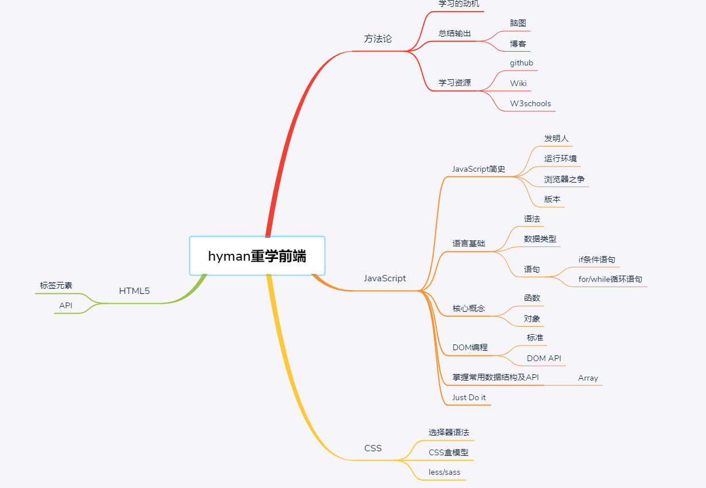

### 我整理的前端脑图
脑图有些不够完善，学习这件事本身是自己的事，希望在训练营的旅途中，逐渐完善脑图，对自己负责。

### 本周总结
#### 职业规划
尽管一直认为职业规划很虚，有时候职业规划的路并不会成为实际会走的路。但是回过头来看看，没有职业规划却可能是原地踏步，缓慢向前的元凶，
因为没有一个大致方向，怎么知道要去哪，没有方向，怎么会拉足马力前行。因此职业规划的意义，在于明确可预见的3-5年，要往哪去，往哪处使力。

有了职业规划，便可以定向地练习获得特定的能力，而要具备特定的能力往往需要某些技术或技巧，而技术技巧的获取通常可以通过掌握某些知识获取。

#### 成长是螺旋式上升的过程
成长是通过获得成就，取得晋升，再成长这么一个螺旋上升的过程。如何获得成就呢？得要有能力。怎么获得能力？怎么证明自己的能力？能力的获得
在于亲身经历过一些，做成过一些，有拿得出的可证明自己的作品或项目。对于成就，可分为业务型成就和技术型成就。不管做一个大项目还是小项目，
按照目标，方案，实施和成果的方式来总结，这样可以定期来盘点获得了哪些成就。

#### 参加训练营的动机和意义
参加前端训练营是为了梳理个人掌握的前端知识体系，能结合后端，轻松完成一个小作品，是博客也好，或其他的web也好。
训练营已参加不止一个了，花大价钱也不是为了想从课程中获得高级技能，更多地是和训练营走一遍，在这个旅途中，尽量花些时间梳理和加强某些
基础，好吧，也就是重学前端，虽然之前也没怎么学过前端。这个过程真的需要多花时间，多加练习对自己负责。
